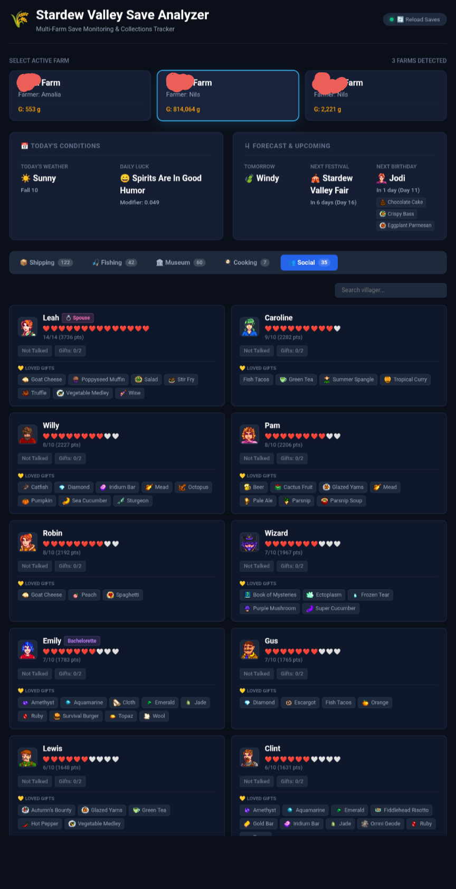
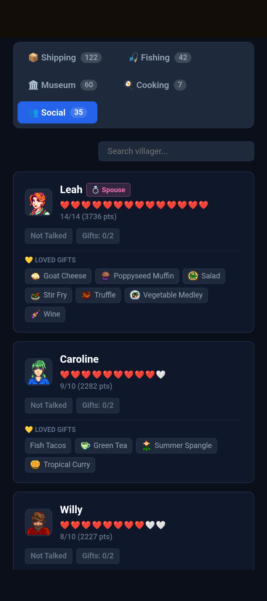
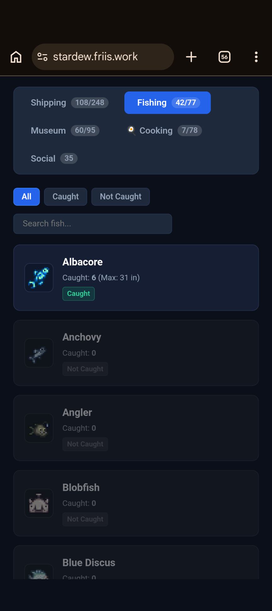
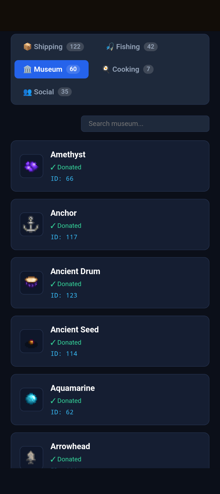
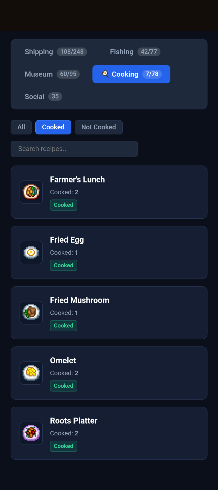
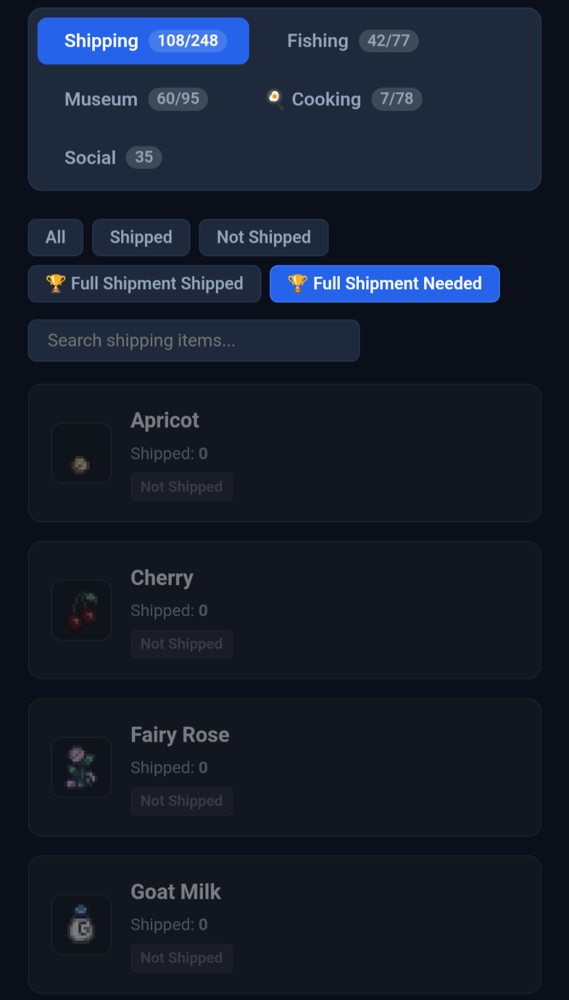

# 🌾 Stardew Valley Save Analyzer


<p align="center">
  
</p>


A lightweight, local-first web dashboard designed specifically for self-hosted homelabs and single-host setups. It parses raw Stardew Valley save XML files and renders a dynamic, responsive dashboard for tracking farm progress, collections, and relationships across multiple saves — without relying on external cloud processing.

---

## 🏠 Self-Hosting & Niche Use Cases

This tool is built from the ground up to solve specific challenges encountered in homelab and self-hosted environments:

- 🗂️ **Multi-Farm Archiving:** Automatically scans and indexes all save subdirectories inside the mounted saves folder. If you manage separate single-player, co-op, or seasonal farms, you can switch between them instantly using top-level tabs.
- 🔒 **Local-First & Privacy-Focused:** Your save data never leaves your infrastructure. Save parsing happens entirely inside your container, generating static HTML output served via an internal Nginx container.
- ⚡ **High Efficiency:** Engineered to consume minimal RAM and CPU, making it perfect for running alongside other home services on low-power hardware, Raspberry Pis, or older mini PCs.

## ✨ Features

- **Multi-Farm Support:** Automatically detects and indexes all farms in your mounted directory with top-level tab switching.
- **Collection Tracking:**
  - 📦 **Shipping:** Shipped item counts and completion status.
  - 🐟 **Fishing:** Fish caught, record lengths, and caught counts.
  - 🏺 **Museum:** Donated artifacts and minerals.
  - 🍳 **Cooking:** Recipes unlocked and cooked counts.
- 💬 **Social Radar:** Track villager friendship heart levels, daily chat statuses, and weekly gift counts.
- 🖼️ **Dynamic Sprites:** Maps internal item IDs to wiki icons with emoji fallbacks.

---
<details>
<summary>📸 <b>Click to expand full screenshot gallery</b></summary>

<br>

#### 📊 Dashboard & Daily Forecast


#### 👥 Friendship & Loved Gifts Tracker


#### 🎣 Fishing Completion & Records


#### 🏛️ Museum Donations & Missing Artifacts


#### 🍳 Cooking Recipes


#### 📦 Shipping Collections


</details>


---

## 🚀 Quickstart (Docker Compose)

The easiest way to deploy the analyzer is using Docker Compose.

```yaml
services:
  stardew-analyzer:
    image: ghcr.io/tbg-scrat/stardew-analyser:latest
    container_name: stardew-analyser
    restart: unless-stopped
    ports:
      - "9999:80"
    volumes:
      - /path/to/your/StardewValley/Saves:/saves:ro
```

```bash
docker compose up -d
```

After spinning up the container you can reach it in your browser under localhost:9999/.

You can mount the actual save location directly into the container, or copy your savegames into a separate location and mount that instead. 

  > *New to Docker? Check out the [Official Docker Compose Getting Started Guide](https://docs.docker.com/compose/gettingstarted/).*
> 


### Default Save File Locations

- **Linux:** `~/.config/StardewValley/Saves`
- **Windows:** `%APPDATA%\StardewValley\Saves`
- **macOS:** `~/.config/StardewValley/Saves`

Depending on the amount of automation you want, you can either copy your files manually or setup automation to copy your files to the container location. 

From personal experience (Android): I use macrodroid in combination with Shizuku to extract the files via schedule out of the android folder into a less restricted location and then push them via Foldersync to the docker host.

On PC it would probably even be easier to copy the files via task scheduler.

For anything apple-related: Sorry, don't own it...

## Feedback welcome!

Vote on upcoming features or jot something down in the comments that I haven't even thought of.

👉 [Cast your vote & join the discussion](https://github.com/Tbg-scrat/stardew-analyser/discussions/1)


## 🛠️ Building Locally

```bash
git clone https://github.com/tbg-scrat/stardew-analyser.git
cd stardew-analyser
docker compose up --build -d
```

---

## ⚖️ Disclaimer & Intellectual Property

This project is an unofficial fan-made tool and is not affiliated with, endorsed by, sponsored by, or associated with ConcernedApe (Eric Barone) or ConcernedApe LLC.

All Stardew Valley assets, item names, character names, graphics, and game data are trademarks and copyrighted property of ConcernedApe LLC. All rights reserved.

## 🤖 AI Assistance Disclaimer

This project was developed with the assistance of Generative AI (LLMs) for scaffolding code, writing Jinja2 HTML templates, refining parsing functions, and drafting documentation. All generated code and logic have been tested, reviewed, and tailored for performance and stability within homelab environments.

## 📜 License

Distributed under the MIT License. See `LICENSE` for more information.
